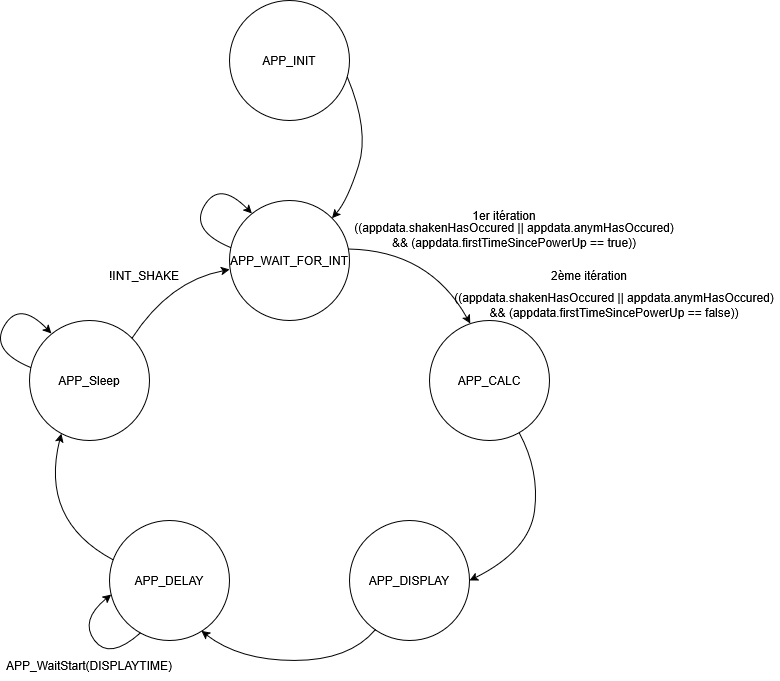

# 2113_DeElectronique_V4

Ce projet implémente une application pour microcontrôleur PIC32MM0064GPL020, développée avec MPLAB X et XC32.

## Sommaire

- [Présentation](#présentation)
- [Informations de génération](#informations-de-génération)
- [Compilation](#compilation)
- [Utilisation](#utilisation)
- [Documentation Doxygen](#documentation-doxygen)
- [Diagrammes](#diagrammes)
- [Ressources](#ressources)

## Présentation

Ce dépôt contient le code source et la configuration pour le projet électronique basé sur le PIC32MM.
Il s’agit de réaliser un dé électronique qui puisse être produit en petite série à l’ETML et distribué aux visiteurs de l’ES, par exemple lors des portes ouvertes. S’agissant d’un cadeau, une attention particulière sera portée à la minimalisation des coûts. Le fonctionnement sera le suivant :

Lorsque le montage est secoué puis reposé à l’horizontale, un nombre aléatoire entre 1 et 6 sera affiché à l’aide de 7 LEDs. Il ne doit y avoir aucun bouton. Les LED seront disposées à la manière d’un dé à lancer. Les LED restent allumées 10 secondes, puis le montage s’éteint (coupure d’alimentation totale, sauf pour l’élément de détection du secouement). Ce dernier est le seul sous tension en permanence et réveille le montage à chaque nouveau secouement.

""" Actuellement un bouttons est nécéssaire lors du premier allumage pour configurer accéléromètre, aussi la demande à été modifier pour passer à 3s d'affichage """

Utilisation de l'accéléromètre MC3419 avec une configuration nécéssitant ~0,5g pour déclenchement. 
La résolution du capteur MC3419 est typiquement de 14 bits (0 à 16383 pour ±2g).
1 LSB = 4g (de -2g à +2g)/ 16384 = 0,000244 g ≈ 0,244 mg

Seuil (g) = Valeur_seuil * (Plage_en_g / 2^résolution)
          = 2000 * (4 / 16384 )
          = 2000 * 0,000244
          = 0,488 g


La documentation technique est générée avec Doxygen.


## Modifications apportées entre V2 et V3

- Modification de la fonction d'attente avec utilisation du timer (précision accrue et meilleure gestion du temps).
- Ajout de la possibilité de modifier le changement de la consigne PWM avec le CoreTimer (meilleure flexibilité et contrôle).
- Ajout du réglage d'intensité automatique avec les "rampes" (transition douce de l'intensité).
- Refactorisation et amélioration des commentaires pour une meilleure génération de documentation Doxygen.
- Refactorisation de la structure principale du main.

## Modifications apportées entre V3 et V4
- Ajout d'un chenillard dans l'état APP_INIT pour tester les LED.
- Mise en commentaire de l'état APP_KILL et ajout de l'état APP_SLEEP.
- Modification du code de manière à ce que le chenillard se déclanche uniquement lorsque la pile est enlevée et remise.

## Informations de générations

```
Product Revision  :  PIC24 / dsPIC33 / PIC32MM MCUs - 1.75.1
Device            :  PIC32MM0064GPL020

Les drivers générés sont testés avec :
    Compiler      :  XC16 v1.35
    MPLAB         :  MPLAB X v5.05

La version 3 de cette application est conçue et testée avec :
    Compiler      :  XC32 v2.5 
    MPLAB         :  MPLAB X v5.50

La version 4 de cette application est conçue et testée avec :
    Compiler      :  XC32 v2.5 
    MPLAB         :  MPLAB X v6.15
```

## Versionning 
 Latest Hardware : 2113E_DeElectronique
 
 Latest Software : 2113_DeElectonique_V4.X_2026

Le Hardware version D et E sont compatibles avec le soft V3

Le Hardware version E sont compatibles avec le soft V4

## Compilation

1. Crée un dossier "PROJ" sous" C:\microchip\harmony\v2_06\apps\"
2. Cloner ce dépôt à l'intérieur  le chemin devrais être : "C:\microchip\harmony\v2_06\apps\PROJ\PRJ_2113_D-sElectronique"
4. Ouvrez le projet dans MPLAB X.
5. Sélectionnez le compilateur XC32 v2.5.
6. Compilez le projet (`Build Project`).

## Utilisation

- Chargez le firmware sur la carte cible (2113E_DeElectronique) via MPLAB X (la carte doit être alimentée en +1,5V).
- Maintenire le bouton S1 enfoncer pendant la durée de programmation de la carte.
- Retirer la sonde de programation (snap/icd4) appuyer sur le switch environs 1s.
- Secouer
- Pour éteindre: retirer la pile 

## Etat actuel 

- Les résistances R14 et R17 ont été changées, 1k & 5k6 --> 10k & 56k.


### Résultat des tirrages 
- sur 130 tirrages: 


Le N°1 sort le plus souvent


## Documentation Doxygen

La documentation complète du code est disponible dans le dossier [html/](html/).  
[Consulter la documentation Doxygen](https://docdees.neocities.org/)
(ouvrir dans un browser une fois le dépot en local) exemple du rendus : 


## Diagrammes

Précédente version (V2)


Précédente version (V3) 


Les autres diagrammes sont disponibles sous "C:\microchip\harmony\v2_06\apps\PROJ\PRJ_2113_D-sElectronique\soft\2113_DeElectronique_V3.X\code2flow"


Nouvelle version (V4)



Les autres diagrammes sont disponibles sous "C:\microchip\harmony\v2_06\apps\PROJ\PRJ_2113_D-sElectronique\doc\Version 4\Machines d'état"

## Ressources

- [Diagramme de flux (Code2Flow)](https://app.code2flow.com/)
- [VS Code](https://code.visualstudio.com/)
- [GitHub Copilot](https://github.com/features/copilot)
- [MPLAB X IDE](https://www.microchip.com/en-us/tools-resources/develop/mplab-x-ide)
- [Graphviz](https://graphviz.gitlab.io/)
- [Doxygen](https://www.doxygen.nl/index.html)
- [MCC Standalone (MPLAB Code Configurator)](https://www.microchip.com/en-us/tools-resources/configure/mplab-code-configurator)
- [Documentation Microchip PIC32MM](https://www.microchip.com/wwwproducts/en/PIC32MM0064GPL020)

---


